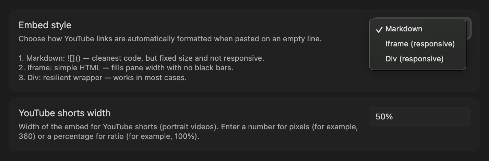
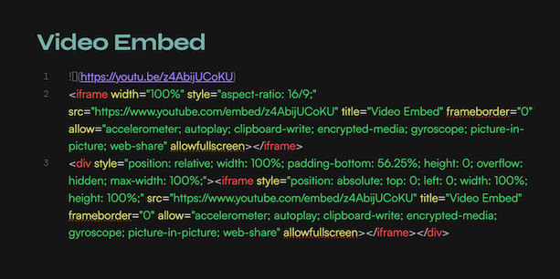
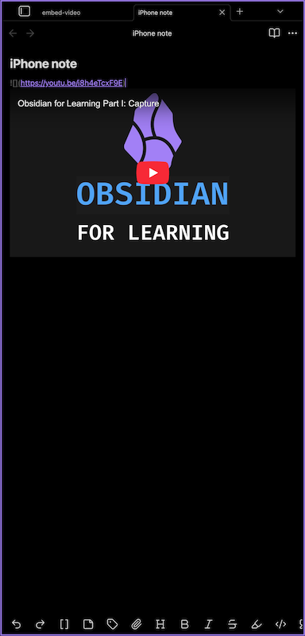

> Simply paste a YouTube URL on an **empty line** in an Obsidian note and it's instantly converted into your preferred embed format (markdown, iframe or div) — no commands, no shortcuts, just paste.

### **Features**

- intercepts YouTube URLs pasted on empty lines
- three preview styles to choose from
    - simple markdown
    - responsive in iframe and div modes
    - working on desktop and mobile

### **Embed styles**

Choose your preferred embed mode in **Settings → Video Embed**.

| Style | Output | Responsive |
|---|---|---|
| markdown | `` | no — fixed size |
| iframe | `<iframe ...>` | yes — fills pane width |
| div | `
<iframe ...>` | yes, in a frame — bulletproof |

###### Results in source mode:

---

### **Usage**

1. copy YouTube video URL (right-click on it: Copy video URL)
2. open any note
3. place your cursor on a blank line
4. paste the YouTube URL (`Cmd+V` / `Ctrl+V`)
5. the URL is automatically replaced with the embed

###### Supported URL formats:
- `https://www.youtube.com/watch?v=...`
- `https://youtu.be/...`
- `https://www.youtube.com/shorts/...`
- `https://www.youtube.com/embed/...`

 

  

 

---

### **Installation**

#### From Obsidian Community Plugins

1. open **Settings → Community plugins**
2. disable `Safe mode` if prompted
3. click `Browse` and search for `Video Embed`
4. install and enable the plugin
5. open Òptions` and choose your preferred style (markdown, iframe, div)

#### Manual

1. download `main.js` and `manifest.json` from the [latest release](../../releases/latest)
2. create a folder `<your vault>/.obsidian/plugins/video-embed/`
3. place both files in that folder
4. reload Obsidian and enable the plugin in **Settings → Community plugins**

---

### **Roadmap**

- **v2** _when repo hits 100 GitHub ⭐_ — more video providers (Vimeo, Dailymotion, …)
- **v3** _when repo hits 1 000 GitHub ⭐_ — import video metadata (title, thumbnail) from URL

### **Contributing**

Found a bug or have a suggestion? [Open an issue](../../issues).

---

### **License**

This project is licensed under **[GPL-3.0](LICENSE)-or-later**.

In practical terms, that means distributed modifications and derivative versions must also remain open source under GPL-compatible terms.

---

made with ⏳ by <a href="https://github.com/punkyard">punkyard</a>

